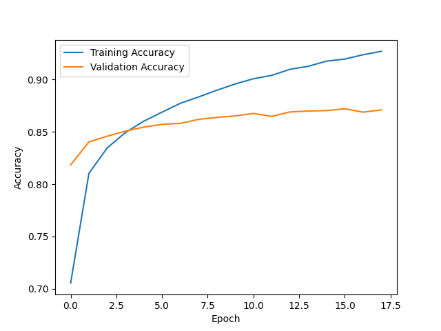

TODO: Fix accuracy plotting not working, adding model name to the plot's title
main bug, accuracy showing learning step


## CIFAR10 Dataset
The CIFAR-10 dataset consists of 60000 32x32 colour images in 10 classes, with 6000 images per class. There are 50000 training images and 10000 test images

The dataset is divided into five training batches and one test batch, each with 10000 images. The test batch contains exactly 1000 randomly-selected images from each class. The training batches contain the remaining images in random order, but some training batches may contain more images from one class than another. Between them, the training batches contain exactly 5000 images from each class

shape (32, 32, 3)

10 classes (airplane, automobile, bird, cat, deer, dog, frog, horse, ship, truck)
- The classes are completely mutually exclusive. There is no overlap between automobiles and trucks. "Automobile" includes sedans, SUVs, things of that sort. "Truck" includes only big trucks. Neither includes pickup trucks

- first time running the code will download cifar10 dataset

## Model Tested

### Notes

Some Architectures include a preprocessing (EfficientNetV2M for instance), so you have to add include_preprocessing=False as an argument when building the model
### ResNet50V2

- The model is 103 layers deep
- The model is pretty light (98mb)
- The model has 25.6M	parameters and performs with 76.0% Top-1 Accuracy and 93.0% Top-5 Accuracy
- total training with 20 epoch ~ 40 mins
- stopped after epoch 18/20 (Early stopping)

### MobileNetV2

- with all in-buit layers freeze and trained on 20 epochs it outputs 0.8469

### EfficientNetV2S

- 20 epochs: 0.8738 accuracy
- disable in-built preprocessing

### 📈 Training Results

Here’s the model’s accuracy over 18 epochs:


---

### Step 1 - Understand what you're working with

- CIFAR-10 has 60,000 RGB images of shape (32, 32, 3)

- 50,000 are for training, 10,000 for testing

- There are 10 classes (airplane, automobile, bird, cat, etc.)

---
### Step 2 - Preprocess the data

- Normalize images → values in [0, 1] instead of [0, 255]

- One-hot encode the labels (Y), since we're doing categorical classification

```python
tensorflow.keras.utils.to_categorical
```
---
### Step 3 - Choosing a pretrained model

- Picking the ResNet50v2
- Making sure the image size are of same shape (pretrained models from tf.keras.applications expect images of size (224, 224))

---
### Step 4 - Create a Lambda layer for resizing

- Resizing the images' shape from (32, 32) to (224, 224)
```python
tf.keras.layers.Lambda(lambda image: tf.image.resize(image, (target_height, target_width)))
```
---
### Step 5 - Freeze most of the base model

- Set ```include_top=False``` (so you can add your own dense head)

- Set ```trainable=False``` for most layers (you’ll only train the top)
---
### Step 6 - Add a custom classification head

- Add a ```GlobalAveragePooling2D()``` to flatten
- Add a few ```Dense``` laters with ReLU activations
- Finish with a ```Dense(10, activation='softmax')``` for 10 classes
---
### Step 7 - Compile the model

- Optimizer: Adam (learning_rate ~1e-4 or 1e-5)
- Loss: categorical_crossentropy
- Metric: accuracy
---
### Step 8 - Train efficiently

- First, compute frozen outputs once (feature extraction approach)
- Then, train your small dense head on those features
    - This drastically reduces training time since the base model isn’t re-evaluated every epoch
- adds a callback for EarlyStopping (stops when validation loss stops improving)
- Use checkpoints to save the best model automatically
---
### Step 9 - Evaluate and tweak

- Adjust learning rate, batch size, number of epochs
- Try different pretrained bases (ResNet50 and MobileNetV2 often perform best here)
- Stop when validation accuracy ≥ 0.87
---
### Step 10 - Save the trained model

```python
model.save('cifar10.h5')
```
---
### Step 11 - Wrap the training
- ```if __name__ == "__main__":```
    - So the script doesn’t automatically train when imported

### Step 12 - Create proper requirements.txt file

- Create the file and fill it with requirements needed
- Freeze the file when the model is ready

